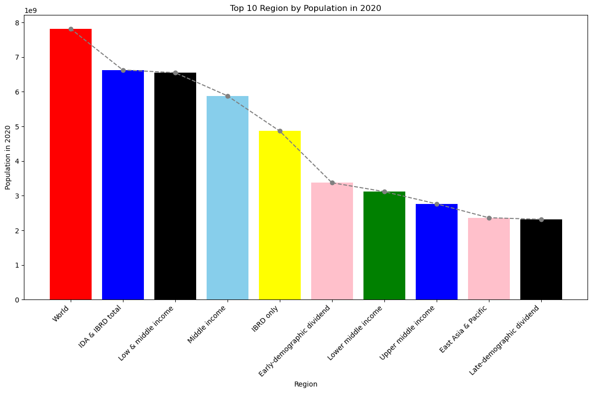
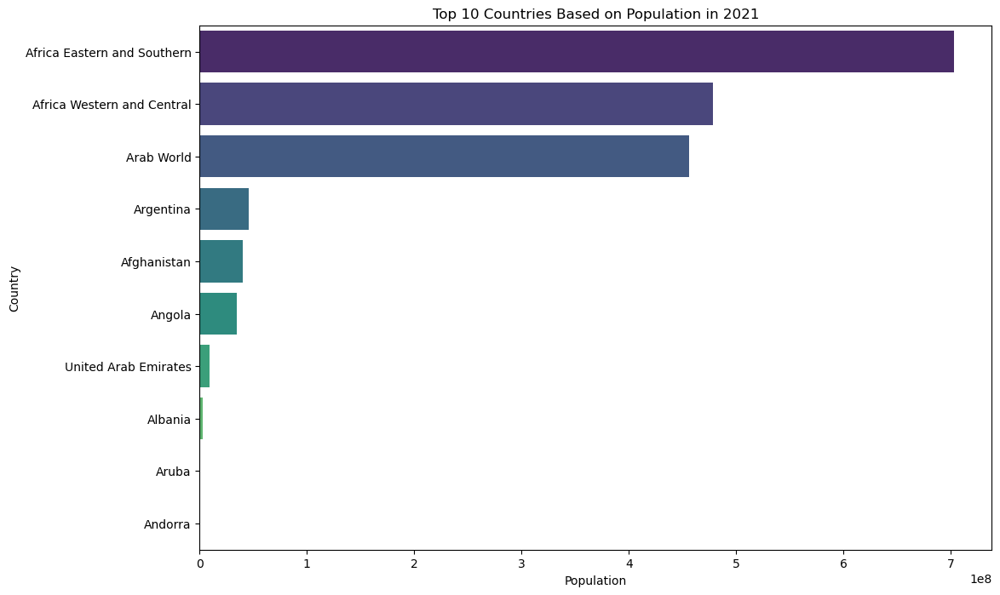
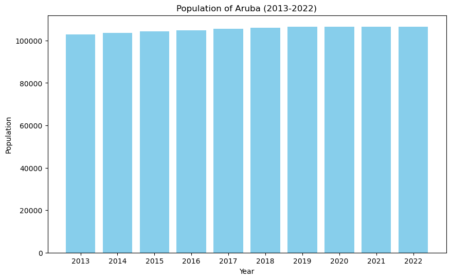
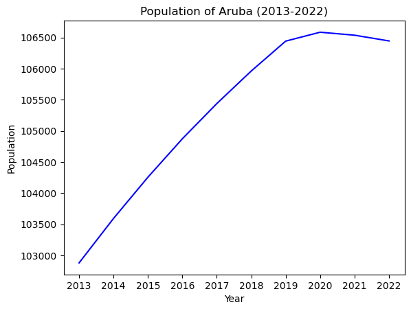
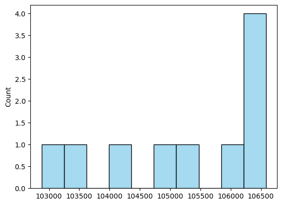
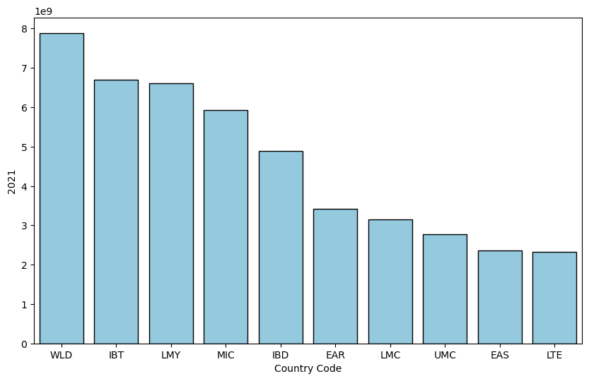
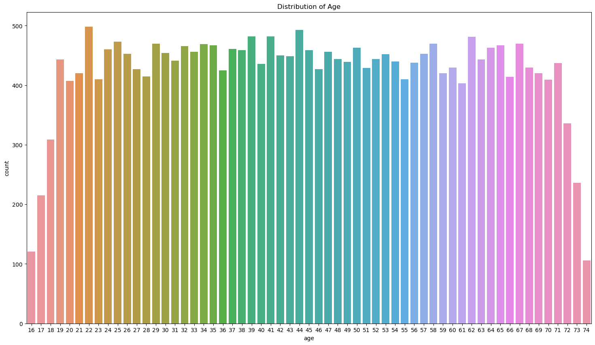
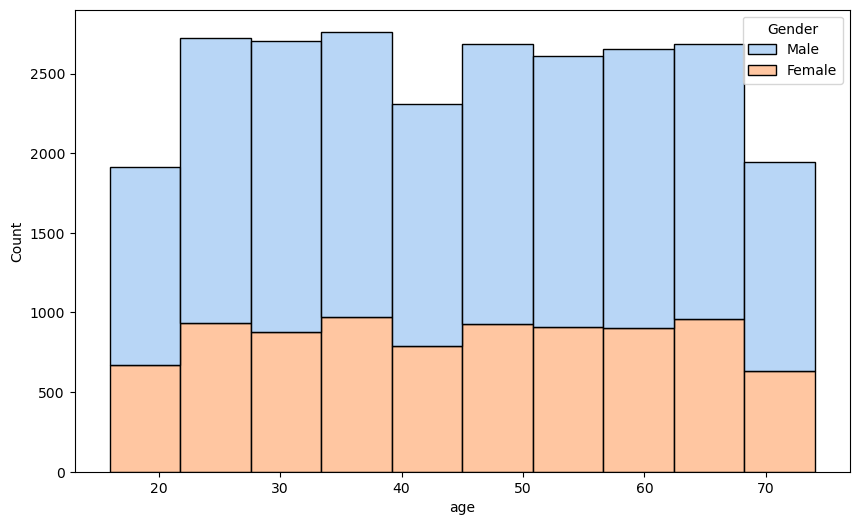

# Task-01
# Create a bar chart or histogram to visualize the distribution of a categorical or continuous variable, such as the distribution of ages or genders in a population.

## Overview
This project analyzes population and insurance-related data using Python and popular data analysis libraries such as Pandas, Matplotlib, and Seaborn. It provides visualizations for population statistics and insights into insurance data.

## Table of Contents
- [Population Analysis](#population-analysis)
  - [Top 10 Regions by Population in 2020](#top-10-regions-by-population-in-2020)
  - [Top 10 Countries by Population in 2021](#top-10-countries-by-population-in-2021)
  - [Population of Aruba (2013-2022)](#population-of-aruba-2013-2022)
- [Insurance Data Analysis](#insurance-data-analysis)
  - [Distribution of Age](#distribution-of-age)
  - [Distribution of Gender](#distribution-of-gender)
  - [Insurance Cost Analysis](#insurance-cost-analysis)

## Population Analysis

### Top 10 Regions by Population in 2020

### Top 10 Countries by Population in 2021

### Population of Aruba (2013-2022)

## Insurance Data Analysis

### Distribution of Age

### Distribution of Gender

### Insurance Cost Analysis

### Insurance Cost Analysis

### Insurance Cost Analysis

### Insurance Cost Analysis

## Contributing
Feel free to contribute to this project. Open an issue or submit a pull request.

## License
This project is licensed under the [MIT License](/LICENCE.txt).
